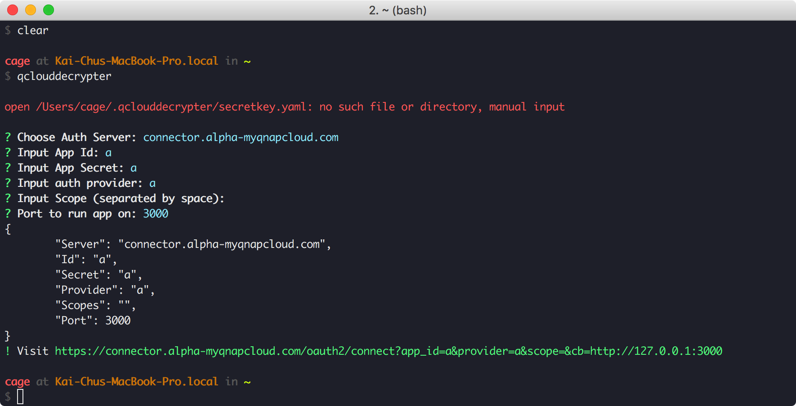
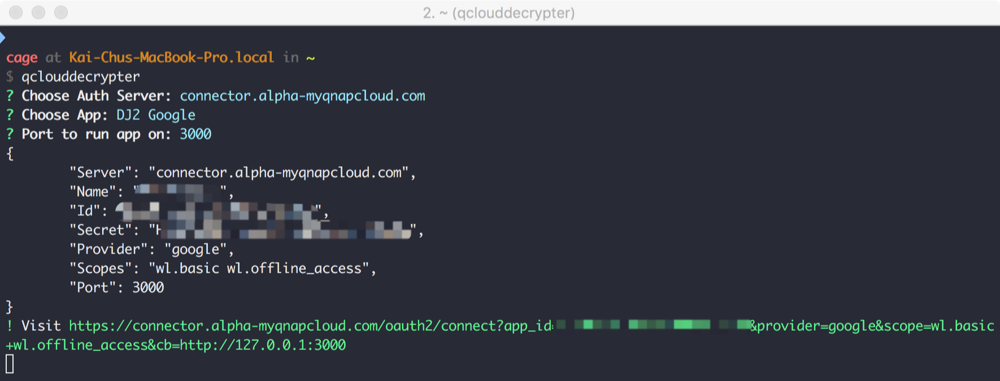
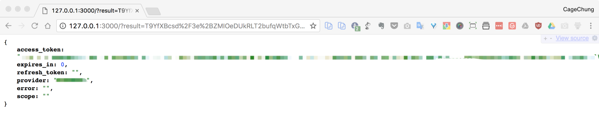

# qclouddecrypter

> a helper to quick decrypt myqnapcloud token







## Install

To install, use `go get`:

```bash
$ go get github.com/cage1016/qclouddecrypter
```

## Getting Started

To getting started, user `qclouddecrypter`:

**input manual**

```bash
$ qclouddecrypter

open /Users/cage/.qclouddecrypter/secretkey.yaml: no such file or directory, manual input

? Choose Auth Server: connector.alpha-myqnapcloud.com
...
```

**load config**

> copy `secretkey.yaml.copy` to `<user-home>/.qclouddecrypter/secretkey.yaml`

_user-home/.qclouddecrypter/secretkey.yaml_

```yaml
apps:
  - name: DJ2 Google
    id: xxxxx
    secret: xxxx
    provider: google
    scopes:
      - wl.basic
      - wl.offline_access
  - name: DJ2 facebook
    id: xxxxx
    secret: xxxxx
    provider: facebook
```

```bash
$ qclouddecrypter
? Choose Auth Server: connector.alpha-myqnapcloud.com
? Choose App:
❯ DJ2 Google
  DJ2 facebook
```

## Author

[kaichu.io](https://kaichu.io)

## Licence
MIT: [https://github.com/cage1016/qclouddecrypter/blob/master/LICENSE](https://github.com/cage1016/qclouddecrypter/blob/master/LICENSE)